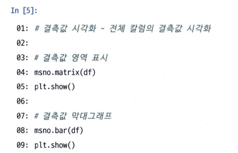

# 통계학 5주차 정규과제

📌통계학 정규과제는 매주 정해진 분량의 『*데이터 분석가가 반드시 알아야 할 모든 것*』 을 읽고 학습하는 것입니다. 이번 주는 아래의 **Statistics_5th_TIL**에 나열된 분량을 읽고 `학습 목표`에 맞게 공부하시면 됩니다.

아래의 문제를 풀어보며 학습 내용을 점검하세요. 문제를 해결하는 과정에서 개념을 스스로 정리하고, 필요한 경우 추가자료와 교재를 다시 참고하여 보완하는 것이 좋습니다.

5주차는 `2부. 데이터 분석 준비하기`를 읽고 새롭게 배운 내용을 정리해주시면 됩니다.


## Statistics_5th_TIL

### 2부. 데이터 분석 준비하기
### 11.데이터 전처리와 파생변수 생성


## Study Schedule

|주차 | 공부 범위     | 완료 여부 |
|----|----------------|----------|
|1주차| 1부 p.2~56     | ✅      |
|2주차| 1부 p.57~79    | ✅      | 
|3주차| 2부 p.82~120   | ✅      | 
|4주차| 2부 p.121~202  | ✅      | 
|5주차| 2부 p.203~254  | ✅      | 
|6주차| 3부 p.300~356  | 🍽️      | 
|7주차| 3부 p.357~615  | 🍽️      | 

<!-- 여기까진 그대로 둬 주세요-->

# 11.데이터 전처리와 파생변수 생성

```
✅ 학습 목표 :
* 결측값과 이상치를 식별하고 적절한 방법으로 처리할 수 있다.
* 데이터 변환과 가공 기법을 학습하고 활용할 수 있다.
* 모델 성능 향상을 위한 파생 변수를 생성하고 활용할 수 있다.
```


## 11.1. 결측값 처리
### 결측값의 종류

* 완전 무작위 결측 : 순수하게 결측값이 무작위로 발생 -> 제거 ok
* 무작위 결측 : 다른 변수의 특성에 의해 해당 변수의 결측치 체계적 발생 
    * 포스기 문제티비 
* 비무작위 결측 : 해당 변수 자체의 특성을 가짐 
    * 개인정보 문제로 익명처리

### 결측값 대체
* 그냥 제거 -> 10% 이하 
* 평균 대치
    * 표준오차 왜곡 / 축소 -> p-value 부정확해 짐 => 적절 X 
* 보간법
    * 시계열 데이터일 경우, 전 날 혹은 다음 날의 데이터와 비슷하게 보간  
          
* 다른 변수와의 관계성 고려하여 처리 
    * 회귀 대치법 : 회귀식 이용해 결측값 추정 (e.g. 연령과 상관성 있는 연 수입 변수 이용하여 보간) -> 단순 상관성 X 변수 간 추정한 회귀식 통해 대치 
        * 분산을 과소 추정하는 문제 -> 확률적 회귀 대치법 (회귀식에 변동성만큼 확률 오차항 추가) 사용 
* 다중 대치법 : 단순 대치 여러 번 수행해서 대치  
      
* 결측값 시각화  
    

## 11.2. 이상치 처리
* 가중치 조정
    * 하한 값과 상한 값을 결정한 후 하한 값보다 작으면 *하한 값*으로 대체, 상한 값보다 크면 *상한 값*대체 
* 도메인 지식을 활용하여 이상치 생성 이유 확인 (e.g. 나이인데 225세...)

## 11.3. 변수 구간화
* 비즈니스적 상황에 맞도록 이산형 변수 -> 범주형 변수 변환 
* 변수 구간화 효율성 확인값 : WOE / IV -> 종속변수 대비 독립 변수가 예측력이 얼마나 강한지 나타내는 지표  
    
* 분포 시각화 나타내는 코드 : displot 

## 11.4. 데이터 표준화와 정규화 스케일링
* 독립 변수의 각 단위가 다르거나 편차가 심할 때 사용 
    * e.g. 기호 물품에 800 이상 소비, 도서 품목에 220 이하 소비 -> 이게 각각 어느 정도의 선호도인지 표준화 해서 판단
* 표준화 : 각 관측치의 값이 전체 평균을 기준으로 어느 정도 떨어져 있는지 나타냄 -> 평균은 0 / 1 표준편차 거리는 +- 1 으로 표현 
* 정규화 : 데이터 범위를 0~1 까지로 변환 
* robustscaler : 이상치의 영향을 보완한 스케일링 기법 

## 11.5. 모델 성능 향상을 위한 파생 변수 생성
* 전체 데이터 / 비즈니스 도메인 이해 파악 필수 
* 파생변수 생성 후 상관분석을 통해 다중공선성 방지 

## 11.6. 슬라이딩 윈도우 데이터 가공
* 실시간 네트워크 패킷 데이터를 처리하는 기법
    * 데이터를 겹쳐 나눔으로써 전체 데이터가 증가하는 원리 차용 -> 많은 분석 데이터셋 확보 / 학습데이터의 최근성을 가짐  
    

## 11.7. 범주형 변수의 가변수 처리
* 가변수 : 범주형 변수를 0과 1의 값을 가지는 변수로 변환 -> 회귀 분석은 연속형 변수만 가능하므로 
    * n 개의 변수 : n-1 개의 가변수 생성 
        * e.g. 혈액형 4개면 3개의 가변수 생성  
             
        * 가장 영향이 적은 (둘 다 아님) 변수 (baseline) 변수는 제거하여 표시 X -> 제거하지 않으면 다중공선성이 높아질 수 있음 (e.g. a, b, c 가 다 0 이면 o 가 당연하게 1이니까 이런 경우 하나 뺌) 
        * 변수 간의 독립성을 위해 하나의 범주 가변수는 제거 

## 11.8. 클래스 불균형 문제 해결을 위한 언더샘플링과 오버샘플링 
* 가중치 밸런싱
    * 중요도가 높은 클래스를 잘못 분류하면 더 큰 손실로 처리 
* 언더샘플링 종류  
      
    
* 오버샘플링 종류  
    
* 언더샘플링과 오버샘플릿 전에 필수적으로 train / test 셋 분리 후 진행!!!  
    **test 에는 오버샘플링 X**

## 11.9. 데이터 거리 측정 방법 
* 어느 관측치가 더 가까이 있는가? (공간상 데이터에서의 데이터 유사도 측정)
* 관측 전 표준화 / 정규화 필요 
* 거리 측정 방법들  
    * 코사인 유사도는 협업 필터링 모델이나 문서 간 유사도 측정 모델에서 good 
    * 1-코사인 유사도 == 코사인 거리  
      
      
      
      
      
<br>
<br>

# 확인 문제

## 문제 1. 데이터 전처리

> **🧚 한 금융회사의 대출 데이터에서 `소득` 변수에 결측치가 포함되어 있다. 다음 중 가장 적절한 결측치 처리 방법은 무엇인가?**

> **[보기]   
1️⃣ 결측값이 포함된 행을 모두 제거한다.  
2️⃣ 결측값을 `소득` 변수의 평균값으로 대체한다.  
3️⃣ `연령`과 `직업군`을 독립변수로 사용하여 회귀 모델을 만들어 `소득` 값을 예측한다.  
4️⃣ 결측값을 보간법을 이용해 채운다.**

> **[데이터 특징]**     
    - `소득` 변수는 연속형 변수이다.  
    - 소득과 `연령`, `직업군` 간에 강한 상관관계가 있다.  
    - 데이터셋에서 `소득` 변수의 결측 비율은 15%이다.

```
3번 
```

## 문제 2. 데이터 스케일링

> **🧚 머신러닝 모델을 학습하는 과정에서, `연봉(단위: 원)`과 `근속연수(단위: 년)`를 동시에 독립변수로 사용해야 합니다. 연봉과 근속연수를 같은 스케일로 맞추기 위해 어떤 스케일링 기법을 적용하는 것이 더 적절한가요?**

<!--표준화와 정규화의 차이점에 대해 고민해보세요.-->

```
단위가 크게 다르기 때문에, 표준에서 떨어진 상대적 수 보다는 절대적 비교가 가능한 정규화를 사용할 것 같다.  
특히 연봉의 경우 이상치의 단위가 커 비교적 이상치의 단위가 적은 근속 연수와 절대적 비교가 어려울 것 같기 때문이다. 
```

### 🎉 수고하셨습니다.